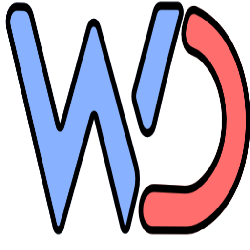
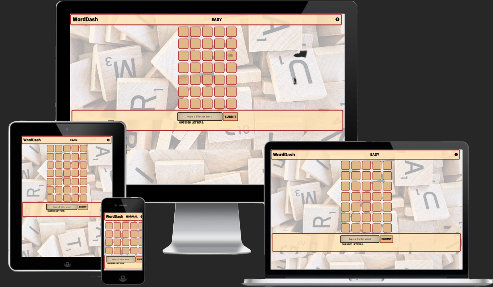
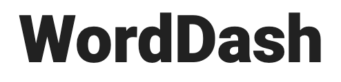
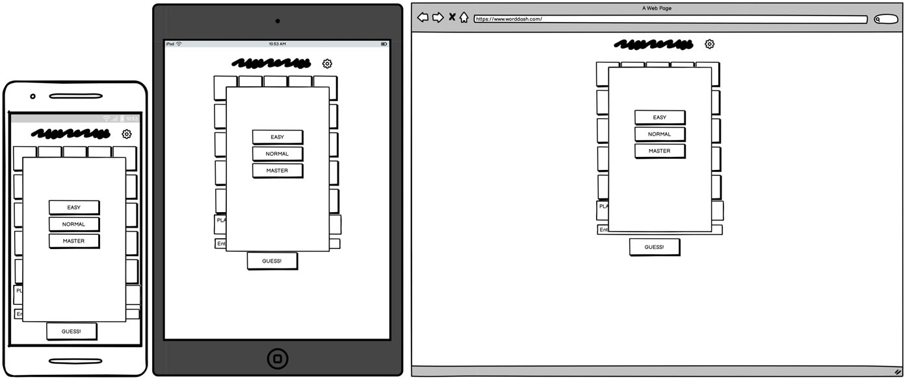
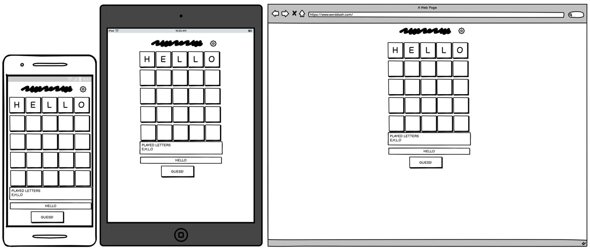
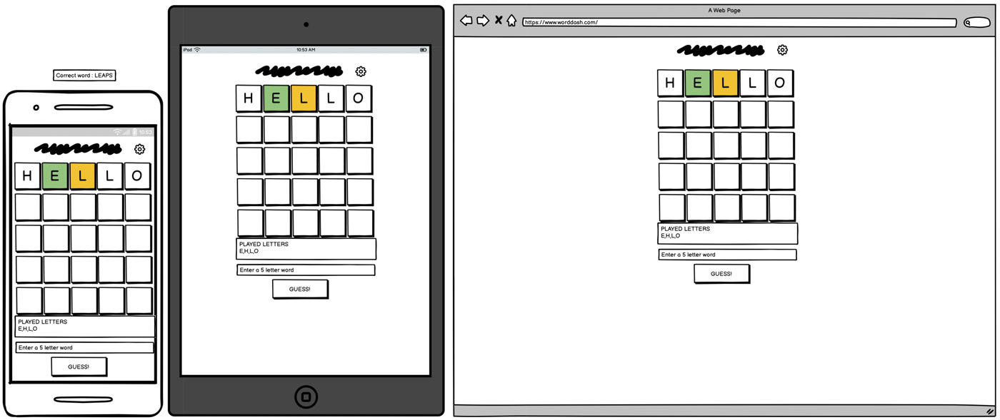
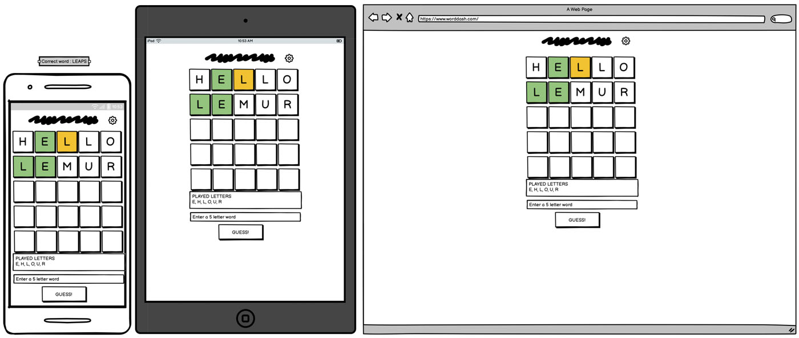
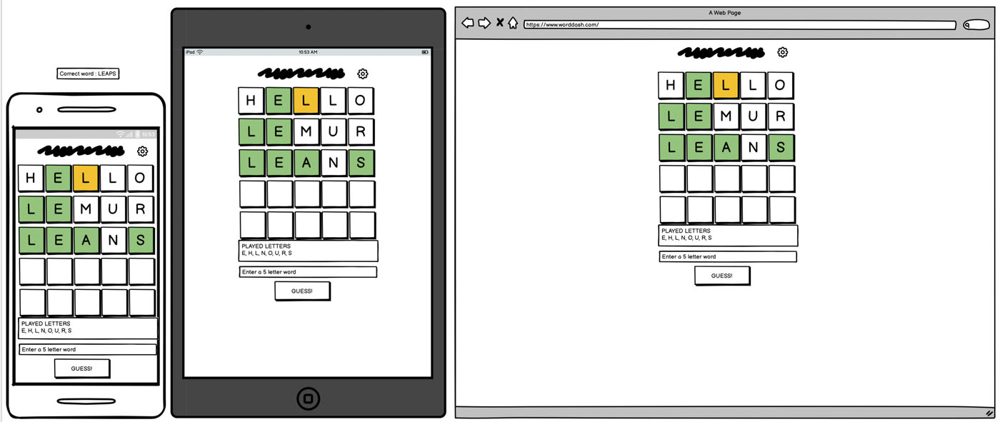
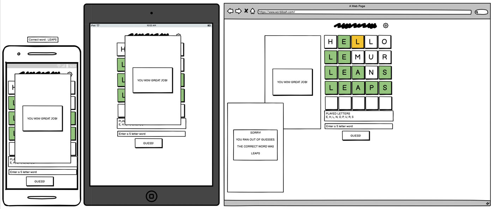
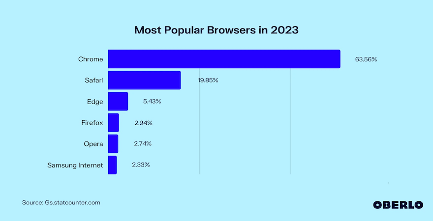

# WordDash Browser Word Guessing Game

## CONTENTS

<!-- TABLE OF CONTENTS -->

  
Table of Contents

  <ol>
    <li><a href="#about-the-project">About The Project</a></li>
    <li><a href="#user-experience">User Experience</a></li>
    <li><a href="#design">Design</a></li>
    <li><a href="#technologies-used">Technologies</a></li>
    <li><a href="#repository">Deployment</a></li>
    <li><a href="#license">License</a></li>
    <li><a href="#image-credits">Image Credits</a></li>
    <li><a href="#testing">Testing</a></li>
    <li><a href="#accessibility">Accessibility</a></li>
    <li><a href="#contact">Contact</a></li>
    <li><a href="#acknowledgments">Acknowledgments</a></li>
  </ol>

<!-- ABOUT THE PROJECT -->
## About The Project
This project was limited to building a fuctional interactive website using only HTML, CSS and JavaScript.
The presented site implements a simple word guessing game in whiche the user is asekd to guess a 5 letter word.
The game area is dynamically built using javascript to adjust how many guesses / rows are shown based on the slected level.
The user recieves feedback on teh guess to see if a letter was correct or correct but in the wrong position.

To maintain information required to track game variables the game is presented on a single page using hidden <divs> that can be displayed as in gaem popups to give the user feedback. This eliminates the need for a back end to store game inomation across multiple site pages.

Implemented popups are:
<ol>
  <li>Info page / Landing page : shown on website load and explains the game. Also shown if user taps the 'i' icon in top right corner</li>
  <li>Level selection Popup : 2 buttons to allow EASY, NORMAL or MASTER level selection</li>
  <li>Win pop up : congratulates teh player for guessing correctly</li>
  <li>Lose pop up : show game over graphic and displays teh correct answer</li>
</ol>

### Built With
* [https://www.gitpod.io/](GitPod)

(<a href="#contents">back to top</a>)

<!-- GETTING STARTED -->
## Accessing the Site

The finished site is hosted with gitpages under:

 
<a href="https://a-hoenig.github.io/worddash/">WordDash Word Guessing Game</a>
 

## User Experience

The game is designed to be single use quick game fun. A maximum of 2 taps are needed to start the game and words can be entered by clicking submit button or just hitting the Enter key.
Guesses are checked for validity at entry (5 valid alphabetic letters) - wrong inputs are rejected and the user is given feeback in the input field.

once a valid guess is accepted it is added to the board. Tiles are colored to indicate correct letters for both position and the letter itself.

The feedback lets the user make an infomed further guess to narrow down the correct word.

Previously played letters are displayed in a list above the input field to help with the guess, especially on smaller screens where not all rows might be visible due to the oncreen keyboard.

once the answer is found, or the maximum guesses is reached, the user recieves the appropriate feedback.

To restart the game, simply reload the page.

## Design

### Colour Scheme

The color scheme was chose to replicate the feel of a table top word game such as scrabble. The background shows a similar theme.
The main color used to achieve this was the system color :moccasin (hex code: #F7E6C0, or RGB(247, 230, 192))
This main color is complemented buy brown or black borders. 
Selectable items on mouse over are show with a green background and white text.

### Typography

One Font are used on the site to simulate the look of the classig table word guessing game Scrabble. 

<a href="https://fonts.google.com/specimen/Roboto?query=roboto">Roboto</a>  -- Used for all word tiles and game displays.

(<a href="#contents">back to top</a>)

### Wireframes

Wireframes were created for mobile, tablet and desktop using Balsamiq.

The Landing page will display 2 popups. An initial info popup to explain the game mechanics
Once acknowleged, the user will be presented with the second popup to select the diffculty level

The main game are will display the game title graphics in a header,
a block of 5 blank letter tiles showing the number of moves available.
A footer where the user can enter a word, click a submit button (enter will also work) as well as see a list of already played letters arranged aplhabetically.

(<a href="#contents">back to top</a>)

each guess will be verified to contain only 5 letters (input field will not accept more than 5). Also, the guess will be checked for only valid letters lower or uppercase
Once a valid word is submitted, it is added to the grid.
Colors give feedback on the gues:

* no color  : That letter is not contained in the word
* orange : the letter is in the answer, but not at that position
* green : a correct letter at the correct position is indicated

using the clues the the user informs their next guess to try and narrow down the correct word.
any letters can be guessed, but the number of guesses available limits how many clues can be gained from simply typing the alphabet.
A future update could include the additional difficulty level of only allowing valid 5 letter words. The number of guesses would have to be adjusted to ensure realistic chance of success.

(<a href="#contents">back to top</a>)

Once the user gueses teh word correctly, or has run out of moves, a popup will display a congratulatory message or indicate game over and reveal the answer.

(<a href="#contents">back to top</a>)

#### The Landing Page

The home page serves as the landing page and aims to impress the visitor with a striking studio portrait image that fills the screen on a minimal interface. The bold white text instantly informs the visitor what the purpose of the site is.

#### The Game Area

(<a href="#contents">back to top</a>)

#### Gameplay

(<a href="#contents">back to top</a>)

#### In Game Popup Windows

#### The Win / Lose User feedback

(<a href="#contents">back to top</a>)

#### Future Implementations

Future developement of the game could include:

1. Running statistics of games played and a points system rewarding the earliest correct guess
2. Optional checkbox to force the user to only post valid 5 letter words
3. Add graphics animations to add a professional look
4. create an in game onscreen keyboard to avoid the specific ios onscreen keyboard issue. This will eliminate the need fo the user to continually scroll bewteen the feeback word on the grid and the text ipnut field. The keyboard can then also color keys to indicate used letters.
5. Additionally: option for 6 letter words
6. Add backend implementation to keep the wordlist off site (on a server). the app could then only fetch a single random word from the server, rather than having to load the entire list of words on page load, improving performance.
7. online challenges to friends and random users (first to finish wins)
8. Option to to display the definition of a word
9. option to prevent repeating already played words

(<a href="#contents">back to top</a>)

## Accessibility

I have been mindful during coding to ensure that the website is as accessible friendly as possible. This has been achieved by:

* Using semantic HTML.
* Using a hover state on all buttons on the site to make it clear to the user if they are hovering over a button.
* Choosing a sans serif font for the site - txshese fonts are suitable for people with dyslexia.
* Ensuring that there is a sufficient colour contrast throughout the site.
* Using detailed alt descriptions of all images and adding aria-labels for navigational elements where neccessary.

*

## Technologies Used

#### Languages:

HTML, CSS only.

* [Balsamiq](https://balsamiq.com/) - Used to create wireframes.

* [Git](https://git-scm.com/) - For version control.

* [Github](https://github.com/) - To save and store the files for the website.

* [GitPod](https://gitpod.io/) - IDE used to create the site.

* [GithubPages](https://pages.github.com/) - Hosts the deployed website

* [Google Fonts](https://fonts.google.com/) - To import the fonts used on the website.

* [Google Developer Tools](https://developers.google.com/web/tools) - To troubleshoot and test features, solve issues with responsiveness and styling.

* [Favicon.io](https://favicon.io/) To create the favicon.

* [Am I Responsive?](http://ami.responsivedesign.is/) To show the website image on a range of devices.

* [Webpage Spell-Check](https://chrome.google.com/webstore/detail/webpage-spell-check/mgdhaoimpabdhmacaclbbjddhngchjik/related) - a google chrome extension that allows you to spell check your webpage. Used to check the site and the readme for spelling errors.

* [ChatGPT](https://chat.openai.com/auth/login) - AI Large Language Model used to generate fake customer testimonials and photographer bio.

* [FakeNameGenerator](https://www.fakenamegenerator.com/) - Used to generate random profile of a fake person.

* [MOV to GIF](https://cloudconvert.com/mov-to-gif) - used to generate gifs from screen recordings.

(<a href="#contents">back to top</a>)

## Repository

### Deployment

The site is deployed using GitHub pages - [WordDash](https://a-hoenig.github.io/WordDash/).

To deploy the site using GitHub pages:

1. Login (or signup) to Github.
2. Go to the repository for this project, [A-Hoenig/WordDash](https://github.com/A-Hoenig/WordDash).
3. Click the settings button.
4. Select pages in the left hand navigation menu.
5. From the source dropdown select main branch and press save.
6. The site has now been deployed, please note that this process may take a few minutes before the site goes live.

### Local Development

#### How to Fork

To fork the repository:

1. Log in (or sign up) to Github.
2. Go to the repository for this project, [A-Hoenig/WordDash](https://github.com/A-Hoenig/WordDash)
3. Click the Fork button in the top right corner.

#### How to Clone

To clone the repository:

1. Log in (or sign up) to GitHub.
2. Go to the repository for this project, [A-Hoenig/WordDash](https://github.com/A-Hoenig/WordDash)
3. Click on the code button, select whether you would like to clone with HTTPS, SSH or GitHub CLI and copy the link shown.
4. Open the terminal in your code editor and change the current working directory to the location you want to use for the cloned directory.
5. Type 'git clone' into the terminal and then paste the link you copied in step 3. Press enter.

(<a href="#contents">back to top</a>)

## Testing

### Validator Testing

#### HTML
  - No errors were returned when passing through the official [W3C validator](https://validator.w3.org/)

#### CSS
  - No major errors were found when passing through the official [(Jigsaw) validator](https://jigsaw.w3.org/css-validator/)

  a single parse error is returned that could not be resolved. Research into the correct syntax of the circle() property (used to align the text around the circular image in the about section) indicates the correct use of the property. Nevertheless, the instruction works as intended.

  

## Manual Testing

### HOME PAGE

| Feature        | Expect | Action | Result |
| :-------------- | :------ | :------ | :------ |
|**GENERAL TESTS** |
|Layout|Layout dynamically changes based on screen size|tested on iphone and all desktop browsers|all elements shift and resize as expected|
|Responsiveness|elements resize when browser window changes|resizing tested on selected browsers|dynamic elements and media queries work as expected|
|Internal Links|BurgerMenu|On small screens burger menu click displays nav bar|nav bar shos up and links work|
|Internal Links|NAV bar elements link to correct page|checked on selected browsers and iPhone|All links work and point to correct page|
|Mouse Over events|NAV elements highlight when user hovers on them|tested on desktop browsers|Works as expected|
|Nav Bar link highlight|correct page (Home) is highlighted|checked on deployed site|displayed correctly|
|Nav bar burger icon|nav bar is displayed below burger icon|tested on all browsers|works as expected|
|**PAGE SPECIFIC TESTS** |
|About section|dynamic resizing of intro text on large screens | tested on selected browsers | works as expected |

### GALLERY PAGE

| Feature        | Expect | Action | Result |
| :-------------- | :------ | :------ | :------ |
|**GENERAL TESTS** |
|Layout|Layout dynamically changes based on screen size|tested on iphone and all desktop browsers|all elements shift and resize as expected|
|Responsiveness|elements resize when browser window changes|resizing tested on selected browsers|dynamic elements and media queries work as expected|
|Internal Links|BurgerMenu|On small screens burger manu click displays nav bar|nav bar shos up and links work|
|Internal Links|NAV bar elements link to correct page|checked on selected browsers and iPhone|All links work and point to correct page|
|Mouse Over events|NAV elements highlight when user hovers on them|tested on desktop browsers|Works as expected|
|Nav Bar link highlight|correct page (Gallery) is highlighted|checked on deployed site|displayed correctly|
|Nav bar burger icon|nav bar is displayed below burger icon|tested on all browsers|works as expected|
|**PAGE SPECIFIC TESTS** |
|Aspect ratios|Photos Display correctly|tested on selected browsers|photos look good even when resizing window|
|Gallery Layout|layout correctly adjusts|tested on all window sizes on 6k screen|works as intended (large screen not enough photos to fill page|
|Picture Highlighting|mouse over highlights picture|testes on desktop browsers|works as expected|
|Photo centering|cropped pictures centered|check no photos are left or right justified|all look good|

### TESTIMONIALS PAGE

| Feature        | Expect | Action | Result |
| :-------------- | :------ | :------ | :------ |
|**GENERAL TESTS** |
|Layout|Layout dynamically changes based on screen size|tested on iphone and all desktop browsers|all elements shift and resize as expected|
|Responsiveness|elements resize when browser window changes|resizing tested on selected browsers|dynamic elements and media queries work as expected|
|Internal Links|BurgerMenu|On small screens burger menu click displays nav bar|nav bar shos up and links work|
|Internal Links|NAV bar elements link to correct page|checked on selected browsers and iPhone|All links work and point to correct page|
|Mouse Over events|NAV elements highlight when user hovers on them|tested on desktop browsers|Works as expected|
|Nav Bar link highlight|correct page (Testimonials) is highlighted|checked on deployed site|displayed correctly|
|Nav bar burger icon|nav bar is displayed below burger icon|tested on all browsers|works as expected|
|**PAGE SPECIFIC TESTS** |
|marquee testimonials|testimonial page displays all feedback elements as vertical scrolling text|tested on all browsers|mostly works, Safari scrolling is rough|
|marquee testimonials|testimonial section resizes with window|tested on all browsers|works as expected dynamically|

### CONTACT PAGE PAGE

| Feature        | Expect | Action | Result |
| :-------------- | :------ | :------ | :------ |
|**GENERAL TESTS** |
|Layout|Layout dynamically changes based on screen size|tested on iphone and all desktop browsers|all elements shift and resize as expected|
|Responsiveness|elements resize when browser window changes|resizing tested on selected browsers|dynamic elements and media queries work as expected|
|Internal Links|BurgerMenu|On small screens burger menu click displays nav bar|nav bar shos up and links work|
|Internal Links|NAV bar elements link to correct page|checked on selected browsers and iPhone|All links work and point to correct page|
|Mouse Over events|NAV elements highlight when user hovers on them|tested on desktop browsers|Works as expected|
|Nav Bar link highlight|off as contact page has own link and is not displayed|checked on deployed site|displayed correctly|
|Nav bar burger icon|nav bar is displayed below burger icon|tested on all browsers|works as expected|
|**PAGE SPECIFIC TESTS** |
|user form submittable|user can send request data and sees what was recieved server side|tested with Chrome|works as expected|
|user form text entry validation|required text entry and data format is set|leaving blank or not entering email is flagged|works as expected|
|user form formatting|form resizes dynamically to left on large screens|ltested on all browsers|works as expected|

(<a href="#contents">back to top</a>)

### Responsiveness

tested manually as well as with Am I Responsive Website

(<a href="#contents">back to top</a>)

(<a href="#contents">back to top</a>)

### Accessibility

An accessibility score of 100 was achieved when anaylsing the site using Google Chrome Dev Tools Lighthouse.

(<a href="#contents">back to top</a>)

### Browser Compatibility

The site was tested on three most popular browsers for functionality:

The only issue regarding browser support was found with safari. On both desktop and mobile versions of Safari, the marquee scrolling feature used in the testimonials page is a little rough and does not scroll smooth. On all other broswers, the feature rendered with no issues.

 <pre>|       SAFARI        |         CHROME         |          EDGE           |</pre>

### Known / Fixed Bugs

* When expanding the browser window the burger icon jumps imperceptibily whe passing the 768px screen width media query. This is most likely due to the fact that the header element is switched to a different grid spacing and the align-items: center; overrides the burger-label top:; property. -- **SOLVED** by adjusting the percentage sizes of the header grid.

* on the gallery page when displaying a 2 column grid, the flex property aligning the individual photos leaves a blank slot after the 5th photo. (start of a new div) - **SOLVED**

A solution was implemented using flex grow on a single div that automativally arranges the pictures into strechable columns. The page now dynamically adjusts equal sized tiles to fill the screen thus removing the need for media queries and allowing for dynamic columns and rows as needed. (solution found under: <a href="https://blog.logrocket.com/responsive-image-gallery-css-flexbox/">Click here</a> )

## Credits

### Code Used

* I used the Code Institute - Love Running walkthrough project as the basis for the pop up nav bar.
* The gallery bug fix was impelementd using this blog post: <a href="https://blog.logrocket.com/responsive-image-gallery-css-flexbox/">How to create a responsive image gallery with CSS flexbox</a> )
* TheQuizArms Pub Quiz project README was recommended as a baseline for this README. many thanks. <a href="https://github.com/kera-cudmore/TheQuizArms/blob/main/README.md">The Quiz Arms README.md</a>

<!-- IMAGE-CREDITS -->
## Image Credits

All images are sourced from stock image sites (pexels, unsplash, pixabay) and are license free.
 
Acknowlegements to the original photographer listed below:

| Image Name    | License | Originator | Link |
| ------------- | :---: | :--- | :--- |
| portrait1.jpg | pexels | Ali Pazani | https://www.pexels.com/photo/woman-wearing-orange-sweater-2613260/ |
| portrait2.jpg | pexels | Ali Pazani | https://www.pexels.com/photo/woman-wearing-brown-fur-beanies-and-white-and-balck-top-2681751/ |
| portrait3.jpg | pexels | Ali Pazani | https://www.pexels.com/photo/woman-in-grey-long-sleeved-shirt-2787341/ |
| portrait4.jpg | pexels | Arsham Haghani | https://www.pexels.com/photo/photo-of-woman-closing-her-eyes-3429877/ |
| portrait5.jpg | pexels | Bruno Salvadori | https://www.pexels.com/photo/light-fashion-person-red-2330169/ |
| portrait6.jpg | pexels | Collis | https://www.pexels.com/de-de/foto/graustufen-seitenansicht-portratfoto-des-mannes-der-mit-geschlossenen-augen-aufwirft-3031397/ |
| portrait7.jpg | pexels | Marlon Schmeiski | https://www.pexels.com/photo/woman-standing-next-to-yellow-wall-3839904/ |
| portrait8.jpg | pexels | George Desipris | https://www.pexels.com/de-de/foto/graustufenfoto-des-mannes-mit-bart-818261/ |
| portrait9.jpg | pexels | Guilherme Almeida | https://www.pexels.com/de-de/foto/1858175/ |
| portrait10.jpg | pexels | Gusher Gill | https://www.pexels.com/photo/portrait-of-woman-in-traditional-clothing-and-with-henna-tattoos-18633023/ |
| portrait11.jpg | pexels | Hywel Jones | https://www.pexels.com/photo/attractive-woman-wearing-white-top-2744193/ |
| portrait12.jpg | pexels | Italo Melo | https://www.pexels.com/de-de/foto/portratfoto-des-lachelnden-mannes-mit-gekreuzten-armen-die-vor-der-weissen-wand-stehen-2379004/ |
| portrait13.jpg | pexels | Arsham Haghani | https://www.pexels.com/photo/photo-of-woman-with-short-hair-3445218/ |
| portrait14.jpg | pexels | Moose Photos | https://www.pexels.com/photo/woman-wearing-pink-collared-half-sleeved-top-1036623/ |
| portrait15.jpg | pexels | Olena Bohovyk | https://www.pexels.com/photo/grayscale-photo-of-man-holding-round-mirror-3635872/ |
| portrait16.jpg | pexels | Pixabay | https://www.pexels.com/de-de/foto/graustufenfoto-der-frau-im-schwarzen-neckholder-kleid-mit-u-ausschnitt-60712/ |
| portrait17.jpg | pexels | Samad Ismayilov | https://www.pexels.com/photo/woman-wearing-black-scoop-neck-top-735552/ |
| portrait18.jpg | pexels | Spencer Selover | https://www.pexels.com/de-de/foto/mann-der-t-shirt-mit-der-rechten-hand-nahe-wange-tragt-428333/ |
| portrait19.jpg | pexels |  Gustavo Santana| https://www.pexels.com/de-de/foto/mann-mit-zigarette-im-mund-1933873/ |
| portrait20.jpg | pexels | Vitaly Gorbachev | https://www.pexels.com/zh-tw/photo/18652728/ |
| photographer.jpg | pexels | Rockerzzz | https://www.pexels.com/de-de/foto/mann-fotografiert-vor-camea-1265718/ |
| testimonials-bg | unsplash | Arsham Haghani | https://unsplash.com/photos/woman-in-black-v-neck-shirt-Ef3AOkt6hHg |
| contact-bg | pixabay | Krivitskiy | https://pixabay.com/de/photos/portrait-m%C3%A4dchen-studio-weiblich-4181643/ |

(<a href="#contents">back to top</a>)

## License

 
 
This project is license free and part of Code Institute Full Stack Developer Course.
It is for educational use only.

<!-- CONTACT -->
## Contact

Alex Hönig -  LimeyDeveloper@pm.me

Project Link: [https://github.com/A-Hoenig/Project-One/tree/main](https://github.com/A-Hoenig/Project-One/tree/main)

## Acknowledgments

I would like to acknowledge the following people:

* Jubril Akolade - My Code Institute Mentor for the guidance.

* Milly - for helping with the tricky stuff, especially github and devtools - thanks!

(<a href="#william-cooke-photography-site">back to top</a>)
