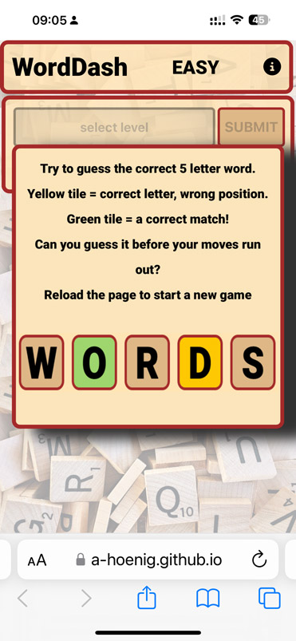
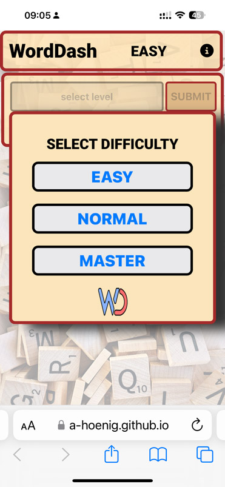
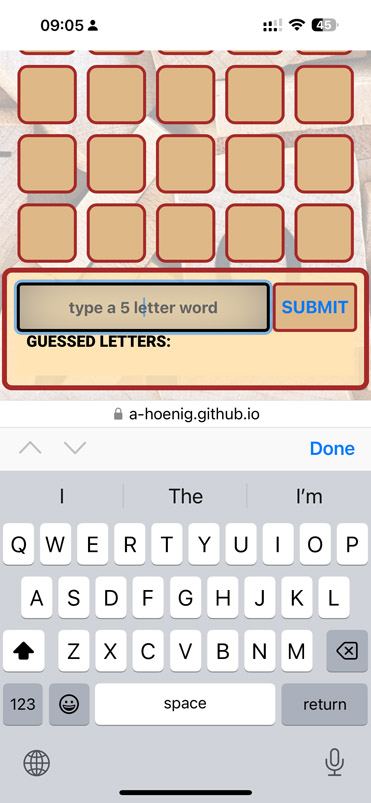
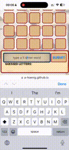
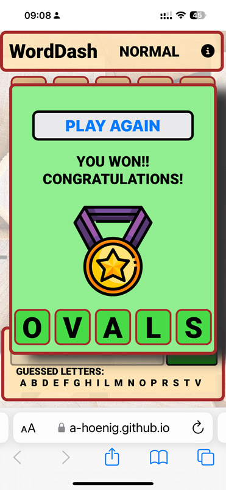
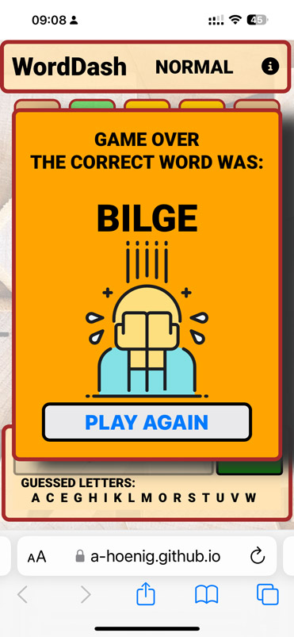
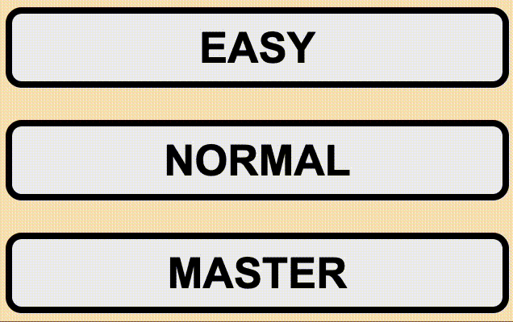

# WordDash Browser Guessing Game

## CONTENTS

<!-- TABLE OF CONTENTS -->

  
Table of Contents

  <ol>
    <li><a href="#about-the-project">About The Project</a></li>
    <li><a href="#user-experience">User Experience</a></li>
    <li><a href="#design">Design</a></li>
    <li><a href="#technologies-used">Technologies</a></li>
    <li><a href="#repository">Deployment</a></li>
    <li><a href="#license">License</a></li>
    <li><a href="#image-credits">Image Credits</a></li>
    <li><a href="#testing">Testing</a></li>
    <li><a href="#accessibility">Accessibility</a></li>
    <li><a href="#contact">Contact</a></li>
    <li><a href="#acknowledgments">Acknowledgments</a></li>
  </ol>

<!-- ABOUT THE PROJECT -->
## About The Project
This project was limited to building a fuctional interactive website using only HTML, CSS and JavaScript.
The presented site implements a simple word guessing game in which the user is asked to guess a 5 letter word.
The game area is dynamically built using javascript to adjust how many guesses, or rows are shown based on the selected level.
The user recieves feedback on the guess to see if a letter was correct, or correct but in the wrong position.

To ensure the variables required to track game progress are always available, the game is presented on a single page using hidden 'divs' that can be displayed as in game popups to give the user feedback. This eliminates the need for a back end or cookies to store game information across multiple site pages.

Implemented popups are:
<ol>
  <li>Info page / Landing page : shown on website load and explains the game. Also shown if user taps the 'i' icon in top right corner</li>
  <li>Level selection Popup : 3 buttons to allow EASY, NORMAL or MASTER level selection</li>
  <li>Win pop up : congratulates the player for guessing correctly</li>
  <li>Lose pop up : shows game over graphic and displays the correct answer</li>
</ol>

### Built With
* [https://www.gitpod.io/](GitPod)

(<a href="#contents">back to top</a>)

<!-- GETTING STARTED -->
## Accessing the Site

The finished site is hosted with gitpages under:

 
<a href="https://a-hoenig.github.io/worddash/">WordDash Word Guessing Game</a>
 

## User Experience

The game is designed to be single-use quick game fun. A maximum of 2 taps are needed to start the game and words can be entered by clicking the Submit button or just hitting the Enter key.
Guesses are checked for validity at entry (5 valid alphabetic letters) - wrong inputs are rejected and the user is given feeback in the input field.

Once a valid guess is accepted it is added to the board. Tiles are colored to indicate correct letters for both position and the letter itself.

The feedback lets the user make an informed further guess to narrow down the correct word.

Previously played letters are displayed in a list above the input field to help with the guess, especially on smaller screens where not all rows might be visible due to the onscreen keyboard.

Once the answer is found, or the maximum guesses is reached, the user recieves the appropriate feedback.

To restart the game, simply reload the page or tap on play again.

## Design

The overall design leans heavily on current popular styles which inlcudes bright complementary colors, cartoon icons and pictograms, rounded corners and simple overall layouts. This was the objective in the overall design.

### Color Scheme

The color scheme was chose to replicate the feel of a table top word game such as scrabble. The background shows a similar theme.
The main color used to achieve this was the system color :moccasin (hex code: #F7E6C0, or RGB(247, 230, 192))
This main color is complemented by brown or black borders. 
Selectable items on mouse-over are shown with a green background and white text.

### Typography

One font is used on the site to simulate the look of the classic table word guessing game Scrabble. To achieve the look, a font weight of 900 is needed.

<a href="https://fonts.google.com/specimen/Roboto?query=roboto">Roboto</a>  -- Used for all word tiles and game displays.

(<a href="#contents">back to top</a>)

### Wireframes

Wireframes were created for mobile, tablet and desktop using Balsamiq.

The Landing page will display 2 popups. An initial info popup to explain the game mechanics, once acknowleged, the user will be presented with the second popup to select the diffculty level.

The main game area will display 3 areas:
* The game title graphics in a header.
* A block of 5 blank letter tiles showing the number of moves available.
* A footer where the user can enter a word, click a Submit button (Enter will also work) as well as see a list of already played letters arranged aplhabetically.

(<a href="#contents">back to top</a>)

Each guess will be verified to contain only 5 letters (input field will not accept more than 5). Also, the guess will be checked for only valid letters, lower or uppercase.
Once a valid word is submitted, it is added to the grid.
Colors give feedback on the guess:

* no color  : that letter is not contained in the word
* orange : the letter is in the answer, but not at that position
* green : a correct letter at the correct position is indicated

Using the clues, the user informs their next guess to try and narrow down the correct word.
Any letters can be guessed, but the number of guesses available limits how many clues can be gained from simply typing the alphabet.
A future update could include the additional difficulty level of only allowing valid 5 letter words. The number of guesses would have to be adjusted to ensure realistic chance of success.

(<a href="#contents">back to top</a>)

Once the user guesses the word correctly, or has run out of moves, a popup will display a congratulatory message or indicate game over and reveal the answer.

(<a href="#contents">back to top</a>)

#### The Landing Page

The home page serves as the landing page and immediately presents the user with the quick game instructions. After tapping to acknowledge, the user can then select the level and very quickly start a game.

#### The Game Area

The game area displays a header with an info button, a main scrollable word grid that is generated dynamically based on how many turns the user may have (based on difficulty level).
The words are input in the footer which contains an input field, a submit button and a feedback section that displays all the letters already played in alphabetical order.

(<a href="#contents">back to top</a>)

#### Gameplay

(<a href="#contents">back to top</a>)

#### Feedback Popup Windows

(<a href="#contents">back to top</a>)

#### Future Implementations

Future development of the game could include:

1. Running statistics of games played and a points system rewarding the earliest correct guess
2. Optional checkbox to force the user to only post valid 5 letter words
3. Add graphic animations to add a professional look
4. Create an in-game onscreen keyboard to avoid the specific iOS onscreen keyboard issue. This will eliminate the need for the user to continually scroll between the feeback word on the grid and the text input field. The keyboard can then also color keys to indicate used letters
5. Additionally: option for 6 letter words
6. Add backend implementation to keep the wordlist off site (on a server). The app could then only fetch a single random word from the server, rather than having to load the entire list of words on page load, improving performance
7. Online challenges to friends and random users (first to finish wins)
8. Option to to display the definition of a word
9. Option to prevent repeating already played words

(<a href="#contents">back to top</a>)

## Accessibility

I have been mindful during coding to ensure that the website is as accessible friendly as possible. This has been achieved by:

* Using semantic HTML.
* Using a hover state on all buttons on the site to make it clear to the user if they are hovering over a button.
* Choosing a sans serif font for the site - these fonts are suitable for people with dyslexia.
* Ensuring that there is a sufficient color contrast throughout the site.
* Using detailed alt descriptions of all images and adding aria-labels for navigational elements where neccessary.

## Technologies Used

#### Languages:

HTML, CSS only.

* [Balsamiq](https://balsamiq.com/) - Used to create wireframes.

* [Git](https://git-scm.com/) - For version control.

* [Github](https://github.com/) - To save and store the files for the website.

* [GitPod](https://gitpod.io/) - IDE used to create the site.

* [GithubPages](https://pages.github.com/) - Hosts the deployed website.

* [Google Fonts](https://fonts.google.com/) - To import the fonts used on the website.

* [Google Developer Tools](https://developers.google.com/web/tools) - To troubleshoot and test features, solve issues with responsiveness and styling.

* [Favicon.io](https://favicon.io/) To create the favicon.

* [Am I Responsive?](http://ami.responsivedesign.is/) To show the website image on a range of devices.

* [MOV to GIF](https://cloudconvert.com/mov-to-gif) - used to generate gifs from screen recordings.

(<a href="#contents">back to top</a>)

## Repository

### Deployment

The site is deployed using GitHub pages - [WordDash](https://a-hoenig.github.io/WordDash/).

To deploy the site using GitHub pages:

1. Login (or signup) to Github.
2. Go to the repository for this project, [A-Hoenig/WordDash](https://github.com/A-Hoenig/WordDash).
3. Click the settings button.
4. Select pages in the left hand navigation menu.
5. From the source dropdown select main branch and press save.
6. The site has now been deployed, please note that this process may take a few minutes before the site goes live.

### Local Development

#### How to Fork

To fork the repository:

1. Log in (or sign up) to Github.
2. Go to the repository for this project, [A-Hoenig/WordDash](https://github.com/A-Hoenig/WordDash)
3. Click the Fork button in the top right corner.

#### How to Clone

To clone the repository:

1. Log in (or sign up) to GitHub.
2. Go to the repository for this project, [A-Hoenig/WordDash](https://github.com/A-Hoenig/WordDash)
3. Click on the code button, select whether you would like to clone with HTTPS, SSH or GitHub CLI and copy the link shown.
4. Open the terminal in your code editor and change the current working directory to the location you want to use for the cloned directory.
5. Type 'git clone' into the terminal and then paste the link you copied in step 3. Press enter.

(<a href="#contents">back to top</a>)

## Testing

### Validator Testing

#### HTML
  - No errors were returned when passing through the official [W3C validator](https://validator.w3.org/)

#### CSS
  
  - No errors were returned when passing CSS code through: [CSS Validator](https://jigsaw.w3.org/css-validator/)

#### JS

  - Validating JS code only produces warnings about newer methods that might no longer be supported my older browsers 
  - Specifically const vs let variable declaration, temperate literals and arrow function syntax.

#### Chrome Lighthouse analysis (mobile selected)
Lighthouse test on the deployed site returned 4x100% score for: 

* Performance
* Accessibility
* Best Practices
* SEO (search engine optimization)

## Manual Testing

### HOME PAGE
**GENERAL TESTS**
| Feature        | Expect | Action | Result |
| :-------------- | :------ | :------ | :------ |
|Initialization|App selects a random word from the given list|Initially output to console|Works as expected. Console output removed to prevent cheating|
|Responsiveness|Layout dynamically changes based on screen size|tested on iphone and all desktop browsers|All elements shift and resize as expected|
|Level Selection|User can click on desired level|Starts the game and builds the grid|Works as expected|
|Info Button|Toggles on and off the info popup|Tapping the 'i' during the game recalls the instructions|Works as expected|
|Random Word Selection|A single word assigned to the answer variable at the beginning|Word is written to DOM for storage|Works as expected|
|Dynamic play area|Number of rows added: easy =7 normal=6, expert =5|Select all levels|Works as expected and footer is displayed correctly after n rows|
|Favicon Display|Favicon loads and is displayed on browser tab|Multpile reloads on deployed and local websites on all browsers|Works on deployed site, local host throws console error|

### GAMEPLAY TESTING

| Feature        | Expect | Action | Result |
| :-------------- | :------ | :------ | :------ |
|Layout|Layout dynamically changes based on screen size|Tested on iphone and all desktop browsers|All elements shift and resize as expected|
|Robust input verification|User can only input 5 x a-z/A-Z, wrong inputs are rejected and feedback shown in input field|Deliberate wrong words input|Works as expected|
|Input with Enter or Submit button|User can input a word by hitting enter or clicking Submit. Once selected, word is added to grid and input box is cleared|Input multiple words clicking with mouse, tapping and using enter|Works as expected|
|Played letters feedback|After a valid word is added, letters added to played list above input button list is unique and alphabetical|Alphabet added one by one to verify all shown|Works as expected|
|Played letters display is dynamic for large lists|If close to 26 letters need to be displayed, a dynamic new row is added. Letters break up before exceeding the div|Added all 26 letters to check correct display|Works as expected|
|Word grid display|User guess is added to the word grid. Once verified, individual letters display on the tiles|Typed deliberately incorrect and correct answers|Works as expected|
|User letter feedback|Tiles are colored based on answer; orange = wrong position; green  = correct position|Typed deliberately incorrect and correct answers|Works as expected, even with double letter words|
|Game ends as planned after last turn|If answer is still not correct, display the lose screen. Works for 5, 6 or 7 turn games|Deliberately guessed all wrong answers on all plattforms|Works as expected|
|Game ends when user guesses correct word (5 green)|Popup should show winner screen and winning word|Typed in correct answer on all turns (first to last)|Works as expected|
|Lose screen shows correct answer|If user does not guess correct, give feedback to the answer|Verified after losing the game|Works as expected|
|Win lose popups show play again button|User can select to play again and site is reloaded. Play again allows the user to change the level again|Tested on win and lose screens|Works as expected|

### POPUPS

**SPECIFIC TESTING**
| Feature        | Expect | Action | Result |
| :-------------- | :------ | :------ | :------ |
|Layout|Layout dynamically changes based on screen size|Tested on iphone and all desktop browsers|All elements shift and resize as expected|
|Info popup shows on start|First thing shows on page load|Multiple page loads|Works as expected|
|Info popup toggles with 'i' button|Clicking 'i' will hide/show game rules|Multiple clicks/taps on all browsers|Works as expected|
|Level popup shown after intro is tapped|Shown behind info popup|Tapping info popup reveals level-select popup|Works as expected|
|Win popup shows on correct guess|Correct word is entered and win message is shown|Entered many correct words|Shows as expected with correct answer|
|Lose popup shows once moves run out|After last guess, lose popup shows message and gives the answer|Play all wrong guesses to trigger loss on all levels|Works as expected|
|All popups are shown centered and float above game area|Popups center on screen and hover above game|Tested on all browsers with dynamic resizing as well|popups display as expected|

(<a href="#contents">back to top</a>)

### Responsiveness

Tested manually on the listed browsers and on iphones. The game was designed to be fully responsive with dynamic sizing without the need for media queries. It is best played in a small browser window, but will work fine on mobile and tablet devices.

(<a href="#contents">back to top</a>)

(<a href="#contents">back to top</a>)

### Browser Compatibility

The site was tested on the three most popular browsers for functionality:

<pre>|       SAFARI MacOS      |         SAFARI iOS      |        CHROME         |          EDGE           |</pre>

Safari was tested on both desktop and mobile versions.
In general, the game works as intended on all browsers.
One issue was discovered during development that could not be fully resolved.
As per the mockups, the original intent was to have the user input fields as part of a fixed / sticky header and allow the guess rows to scroll underneath. However, on safari mobile phones, once the user clicks to start typing a word, the onscreen keyboard is presented. In safari, once this happens, it overrides the fixed position of the header and scrolls it off the screen, greatly reducing usability. This is a known issue and an obvious easy workaround could not be found. As a result, the overall design was changed to add the input fields to the footer and add a scrolling feature to the current user guess row to allow the user to type, but then also see the word feedback once added to the grid.
A fix for this would be to remove the need for the onscreen keyboard by providing a built in on screen keyboard that can be fixed, moved and styled as needed for ease of use.

### Known / Fixed Bugs

No bugs found impacting playability or styling.

## Credits

### Code Used

* TheQuizArms Pub Quiz project README was recommended as a baseline for this README. Many thanks. <a href="https://github.com/kera-cudmore/TheQuizArms/blob/main/README.md">The Quiz Arms README.md</a>

<!-- IMAGE-CREDITS -->
## Image Credits

All graphics are sourced from stock image sites (Reshot, Pexels) and are license free.
 

| Image Name    | License | Originator | Link |
| ------------- | :---: | :--- | :--- |
|background.webp | pexels | Pixabay | https://www.pexels.com/de-de/foto/brown-wooden-scrabble-lot-278881/ |
|reshot-icon-sad.svg|reshot|n/a|https://www.reshot.com/free-svg-icons/item/melancholia-4SYTWLM68P/|
|reshot-icon-winner.svg|reshot|n/a|https://www.reshot.com/free-svg-icons/item/winner-D87WTAELR2/|

All other graphics including favicon were self generated.

(<a href="#contents">back to top</a>)

## Word List
The comprehensive list of 5 letter words was sourced at:

[Jotto Word List](https://www.easysurf.cc/list6.htm)

As the list was a full dictionary list of ALL words (including profanity, slurs and trigger words), obvious objectionable words were manually removed.
Further improvement to the list is recommended to remove obscure or obsolete words aswell.

## License

 
 
This project is license free and part of Code Institute Full Stack Developer Course.
It is for educational use only.

<!-- CONTACT -->
## Contact

Alex Hönig -  LimeyDeveloper@pm.me

Project Link: [https://github.com/A-Hoenig/Project-One/tree/main](https://github.com/A-Hoenig/Project-One/tree/main)

## Acknowledgments

I would like to acknowledge the following people:

* Jubril Akolade - My Code Institute Mentor for the guidance.
* Martin from the Tutor team who helped me find the tricky "= vs === bug" as well as the issues with the favicon paths. Thanks!

(<a href="#contents">back to top</a>)
